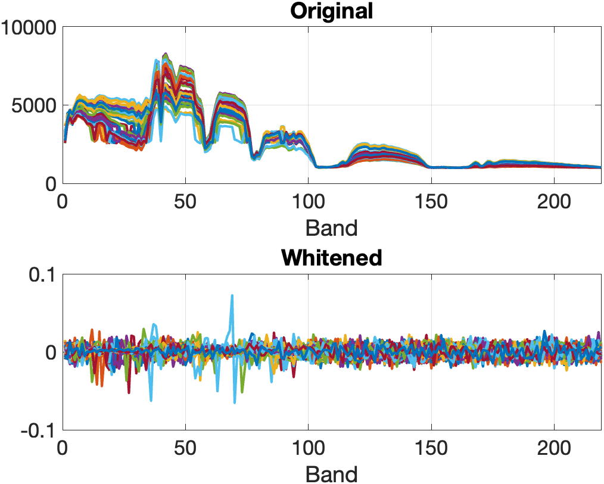
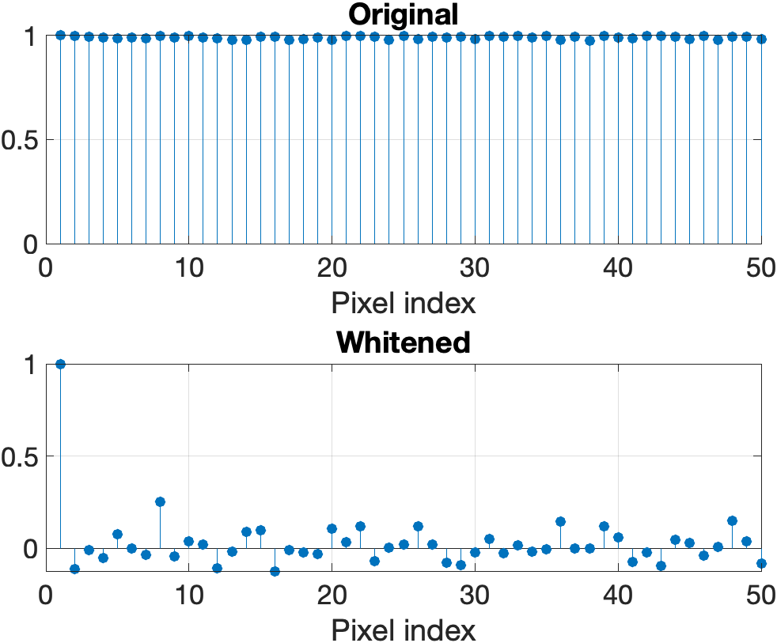

# 目标检测

在普通的彩色图像中进行目标检测往往不仅需要目标的颜色信息，还需要目标的形态信息。这是因为普通的彩色图像只包含 RGB 三个波段，所包含的信息过少，目标与背景之间的区分度较低。比如真植被和假植被在彩色图像中都是绿色，很难区分。而多光谱或高光谱图像具有丰富的光谱维度信息，往往只需要获得目标光谱就足以进行目标检测。一般来说，针对一幅多（高）光谱图像，目标检测算法的目的是生成一副灰度图，其中目标区域的像素值与背景区域的像素值差异尽可能大。对此，有很多算法发展了出来，本章将首先简单介绍问题的模型，然后介绍一些常用的算法。

本章内容如下：

-   [1. 问题建模](#1-问题建模)
-   [2. 常用算法介绍](#2-常用算法介绍)
    -   [2.1. 光谱角度映射（Spectral Angle Mapper）](#21-光谱角度映射spectral-angle-mapper)
    -   [2.2. 约束能量最小化（CEM）](#22-约束能量最小化cem)

## 1. 问题建模

设有一幅光谱图像 $\mathbf{H} \in \mathbb{R}^{m \times n \times l}$，即图像域大小为 $m\times n$，具有 $l$ 个波段。可以通过简单的 resize 操作将其转换为一个 $N \times L$ 的矩阵

$$
\mathbf{X} = \begin{bmatrix} \mathbf{x}_{1}^{\mathrm{T}} \\ \mathbf{x}_{2}^{\mathrm{T}} \\ \vdots \\ \mathbf{x}\_{N}^{\mathrm{T}} \\ \end{bmatrix}
$$

其中 $N=m \times n$ ， $L=l$ ， $\mathbf{x}_{i} \in \mathbb{R}^{L \times 1}$ 为第$i$个像素的光谱。假设目标光谱为$\mathbf{d}$，那么目标检测的目标是找到一个映射函数 $f(\cdot)$ ：

$$
f(\mathbf{x}_{i}, \mathbf{d}) = \left\{
\begin{aligned}
1, & \quad \mathbf{x}_{i} = \mathbf{d} \\
0, & \quad \mathbf{x}_{i} \neq \mathbf{d}
\end{aligned} \right.
$$

将该映射函数作用到整个数据上，我们可以得到一个向量$f(\mathbf{X}, \mathbf{d}) \in \mathbb{R}^{N \times 1}$，接着可以将这个向量 resize 为一个 $m \times n$ 的图像。该二值图像即为目标检测的结果，其中目标区域的像素值为 1，背景区域的像素值为 0。

但在实际应用中，这样简单的模型是不够的。一是，图像中往往会受到光照、噪声等各种因素的干扰，此时尽管确实存在目标，但与目标光谱 $\mathbf{d}$ 完全相同的光谱在图像中并不存在。二是，在高光谱图像中往往会存在混像元，即一个像元中包含了多个地物的光谱。对于这些混像元，显然并不能简单地将其归类为目标像素或是非目标像素。

值得注意的是，高光谱图像具有较高的光谱分辨率，地物之间具有较好的可分性，因此一个线性函数往往就能够获得较好的结果。下文中，我们将介绍一些经典的高光谱图像目标检测算法，这些算法大部分都是基于线性模型的。

## 2. 常用算法介绍

### 2.1. 光谱角度映射（Spectral Angle Mapper）

光谱角度映射（Spectral Angle Mapper，SAM）是一种基于光谱之间夹角的目标检测算法。其基本思想为：像元的光谱与目标光谱之间的夹角越小，说明该像元与目标光谱越相似，因此该像元越可能是目标像元。SAM 对光照强度不敏感，是一种非常简单实用的目标检测算法。SAM 的计算公式如下：

$$
f(\mathbf{x}_{i}, \mathbf{d}) = \cos^{-1}\left(\frac{\mathbf{x}_{i}^{\mathrm{T}}\mathbf{d}}{\|\mathbf{x}_{i}\|\|\mathbf{d}\|}\right).
$$

需要注意的是，根据上式，$f(\mathbf{x}_{i}, \mathbf{d})$ 越小，则说明 $\mathbf{x}_{i}$ 与 $\mathbf{d}$ 越相似。有的时候我们会省去 $\cos^{-1}$，直接令

$$
f(\mathbf{x}_{i}, \mathbf{d}) = \frac{\mathbf{x}_{i}^{\mathrm{T}}\mathbf{d}}{\|\mathbf{x}_{i}\|\|\mathbf{d}\|},
$$

也就是计算目标光谱与像元光谱的相关系数。此时，$f(\mathbf{x}_{i}, \mathbf{d})$ 越大，则说明 $\mathbf{x}_{i}$ 与 $\mathbf{d}$ 越相似。特别地，当 $\mathbf{x}_{i} = \mathbf{d}$ 时，$f(\mathbf{x}_{i}, \mathbf{d}) = 1$。

有的时候，直接计算光谱夹角效果并不好。这是因为获得地物的光谱实际上是日光到达地面后的光谱再乘上地物的反射率，所以不同地物的光谱看起来非常接近（夹角很小）。因此，SAM 通常在校正后的反射率数据中使用。或者，我们可以先对高光谱图像进行白化，之后再对进行目标检测。

从 \cref{fig:sam_compare_1} 可以看出，在原始数据中，不同地物的光谱大致趋势是很接近的，但白化之后它们之间区别就很明显了。进一步地，从 \cref{fig:sam_compare_2} 可以看到，白化之后，不同地物的光谱之间的相关系数远远小于白化之前的。

    <figure style="text-align:center;margin-right:30px;">
        
        <figcaption>(a) 随机选择 50 个像元绘制其光谱</figcaption>
    </figure>
    <figure style="text-align:center;margin-right:30px;">
        
        <figcaption>(b) 这 50 个像元与第一个像元之间的相关系数</figcaption>
    </figure>

    
 原始数据对比白化后数据 

### 2.2. 约束能量最小化（CEM）

直接使用 SAM 的效果有可能不理想，这是因为数据的分布并不是均匀的，简单地衡量光谱之间的夹角（或者相关系数）并不能很好地区分目标像元和非目标像元。因此，我们希望目标检测算法对数据的分布不敏感，这样使用者就无需手动对数据进行预处理了。约束能量最小化（Constrained Energy Minimization，CEM），就是一个这样的算法。它的基本思想是找到一个投影向量，使得投影后的数据的能量最小（Frobenius 范数最小）的同时目标向量的投影值为 1。不妨假设数据为$\mathbf{X} \in \mathbb{R}^{N \times L}$，目标向量为$\mathbf{d} \in \mathbb{R}^{L \times 1}$，投影向量为$\mathbf{w} \in \mathbb{R}^{L \times 1}$，则 CEM 的目标函数为：

$$
\min*{\mathbf{w}} \frac{1}{2}\left\| \mathbf{X} \mathbf{w} \right\|*{\mathrm{F}}^{2} \quad \text{s.t.} \quad \mathbf{d}^{\mathrm{T}}\mathbf{w} = 1.
$$

其中，$\|\cdot\|_{\mathrm{F}}$ 表示矩阵的 Frobenius 范数。注意到

$$
\left\| \mathbf{X} \mathbf{w} \right\|\_{\mathrm{F}}^{2} = (\mathbf{X} \mathbf{w})^{\mathrm{T}}(\mathbf{X} \mathbf{w}) = \mathbf{w}^{\mathrm{T}}(\mathbf{X}^{\mathrm{T}}\mathbf{X})\mathbf{w} = \mathbf{w}^{\mathrm{T}}\mathbf{R}\mathbf{w},
$$

其中$\mathbf{R} = \mathbf{X}^{\mathrm{T}}\mathbf{X}$为数据的相关矩阵。因此，CEM 的目标函数可以精简成：

$$
\min\_{\mathbf{w}} \frac{1}{2} \mathbf{w}^{\mathrm{T}}\mathbf{R}\mathbf{w} \quad \text{s.t.} \quad \mathbf{d}^{\mathrm{T}}\mathbf{w} = 1.
$$

这是一个等式约束二次规划问题，并且是凸的，可以使用拉格朗日乘子法得到最优解。

具体地，我们令

$$
\mathcal{L}(\mathbf{w}, \lambda) = \frac{1}{2} \mathbf{w}^{\mathrm{T}}\mathbf{R}\mathbf{w} - \lambda\left(\mathbf{d}^{\mathrm{T}}\mathbf{w} - 1\right),
$$

则有

$$
\begin{aligned}
\frac{\partial \mathcal{L}}{\partial \mathbf{w}} & = \mathbf{R}\mathbf{w} - \lambda\mathbf{d} = 0, \\
\frac{\partial \mathcal{L}}{\partial \lambda} & = -\mathbf{d}^{\mathrm{T}}\mathbf{w} + 1 = 0.
\end{aligned}
$$

第一个等式为 0 可以得到

$$
\mathbf{w} = \frac{1}{\lambda}\mathbf{R}^{-1}\mathbf{d},
$$

将该式带入到$-\mathbf{d}^{\mathrm{T}}\mathbf{w} + 1 = 0$中，得到

$$
\lambda = \frac{1}{\mathbf{d}^{\mathrm{T}}\mathbf{R}^{-1}\mathbf{d}}.
$$

因此，最佳的投影方向有如下表达式

$$
\mathbf{w} = \frac{\mathbf{R}^{-1}\mathbf{d}}{\mathbf{d}^{\mathrm{T}}\mathbf{R}^{-1}\mathbf{d}}.
$$

更进一步地，第$i$个像素$\mathbf{x}_{i}$的映射值$f(\mathbf{x}_{i}, \mathbf{d})$可以通过下式计算得到

$$
f(\mathbf{x}_{i}, \mathbf{d}) = \frac{\mathbf{x}_{i}^{\mathrm{T}}\mathbf{R}^{-1}\mathbf{d}}{\mathbf{d}^{\mathrm{T}}\mathbf{R}^{-1}\mathbf{d}}.
$$

注意到，数据可以通过如下的公式进行白化：

$$
\hat{\mathbf{X}} = \mathbf{X}\mathbf{R}^{-\frac{1}{2}}.
$$

显然，白化后的数据的行协方差矩阵为单位矩阵，即

$$
\hat{\mathbf{X}}^{\mathrm{T}}\hat{\mathbf{X}} = (\mathbf{X}\mathbf{R}^{-\frac{1}{2}})^{\mathrm{T}} (\mathbf{X}\mathbf{R}^{-\frac{1}{2}}) = \mathbf{R}^{-\frac{1}{2}} (\mathbf{X}^{\mathrm{T}} \mathbf{X}) \mathbf{R}^{-\frac{1}{2}} = \mathbf{R}^{-\frac{1}{2}} \mathbf{R} \mathbf{R}^{-\frac{1}{2}} = \mathbf{I}.
$$

如果我们令$\hat{\mathbf{x}}_{i} = \mathbf{R}^{-\frac{1}{2}}\mathbf{x}_{i}$, $\hat{\mathbf{d}} = \mathbf{R}^{-\frac{1}{2}} \mathbf{d}$，也就是先对数据进行白化，再进行 CEM，那么检测结果可以写成

$$
f(\hat{\mathbf{x}}_{i}, \hat{\mathbf{d}}) = \frac{\hat{\mathbf{x}}_{i}^{\mathrm{T}}\hat{\mathbf{d}}}{\hat{\mathbf{d}}^{\mathrm{T}}\hat{\mathbf{d}}} = \frac{1}{|\mathbf{d}|} \frac{\hat{\mathbf{x}}_{i}^{\mathrm{T}}\hat{\mathbf{d}}}{|\mathbf{d}|}.
$$

而$\frac{\hat{\mathbf{x}}_{i}^{\mathrm{T}}\hat{\mathbf{d}}}{|\mathbf{d}|}$计算的正是向量$\hat{\mathbf{x}}\_{i}$在向量$\hat{\mathbf{d}}$上的投影长度。因此，CEM 进行目标检测的过程等价于对数据进行了归一化处理后的再计算数据在目标向量上的投影值，两者之间仅相差一个常系数$\frac{1}{|\mathbf{d}|}$。

不过有意思的地方就在于，CEM 通过约束目标输出为 1，同时使得整个图像输出的能量最小化，就自然地导出了一个数据白化的过程。这暗示了数据预处理的重要性，有时候算法效果不好，有可能是我们没有考虑数据本身的分布。当然，一个好的算法本身就应当考虑到数据的分布，而需要人为地对数据进行预处理。从这个层面来说，CEM 还是相当优雅的。
