# Hyperspectral Image Toolbox

本项目致力于搭建一个 Matlab 版本的高光谱图像处理的基础工具箱，包括但不限于高光谱图像的波段选择、降维、聚类、分类、图像配准等。本项目的核心目的是为了方便大家学习和研究高光谱图像处理算法，因此针对每一个算法都会提供详细的注释和说明，以及一些简单的示例。此外项目中还提供了一些常用的高光谱数据集，方便大家进行测试。

尽管本项目以高光谱图像处理为主，但是其中涉及到的算法并不局限于高光谱图像处理领域。高光谱图像作为一种三维的数据，本身就是一维信号和二维信号的一种结合（光谱维可以看作一维信号，空间维可以看作是二维图像）。但这种结合并不能看作是简单的组合，而是一种升维，这让高光谱图像本身具有了特殊的性质。而高维数据往往都具备类似的性质，而高光谱图像可以看作是一个最简单的实例，也是唯一可以可视化的数据（四维及以上的数据无法直接可视化）。因此，对于想要进一步深入学习和研究数据处理算法的同学，不妨将本项目作为一个敲门砖或是一个垫脚石。

## 算法

### 波段选择

- [ECA](Papers/ECA.pdf) - Exemplar Component Analysis: A Fast Band Selection Method for Hyperspectral Imagery
- [EFDPC](Papers/EFDPC.pdf) - A Novel Ranking-Based Clustering Approach for Hyperspectral Band Selection
- [FVGBS](Papers/FVGBS.pdf) - Fast Volume Gradient Based Band Selection: A Fast Volume Gradient Based Band Selection Method for Hyperspectral_Image.
- [MNBS](Papers/MNBS.pdf) - A New Band Selection Method for Hyperspectral Image Based on Data Quality
- [OPBS](Papers/OPBS.pdf) - A Geometry-Based Band Selection Approach for Hyperspectral Image Analysis

### Clustering

- [CCA](Papers/CCA.pdf) - Clustering of Continuous Attributes
- [FSFDP](Papers/FSFDP.pdf) - Clustering by Fast Search and Find of Density Peaks
- [MeanShift](Papers/Meanshift.pdf) - Mean Shift Clustering
- [SC](Papers/SC.pdf) - Spectral Clustering
- [SNMF](Papers/SNMF.pdf) - Symmetric Non-negative Matrix Factorization for Graph Clustering

### Data Analysis

- [FastICA](Papers/FastICA.pdf) - Fast Independent Component Analysis
- [LLE](Papers/LLE.pdf) - Locally Linear Embedding
- [LS](Papers/LS.pdf) - Linear Least Squares Regression
- [MNF](Papers/MNF.pdf) - Minimum Noise Fraction
- [NNLS](Papers/NNLS.pdf) - Nonnegative Least Squares
- [PCA](Papers/PCA.pdf) - Principal Component Analysis
- [PSA](Papers/PSA.pdf) - Principal Skewness Analysis
- [TLS](Papers/TLS.pdf) - Total Least Squares

### Endmember Extraction

- [MVCNMF](Papers/MVCNMF.pdf) - Minimum Volume Constrained Nonnegative Matrix Factorization
- [NFINDR](Papers/NFINDER.pdf) - N-FINDR: an algorithm for fast autonomous spectral end-member determination in hyperspectral data

### Image Registration

- [ANCPS](Papers/ANCPS.pdf) - A New Translation Matching Method Based on Autocorrelated Normalized Cross-Power Spectrum
- [CSM](Papers/CSM.pdf) - Cyclic Shift Matrix - A New Tool for the Translation Matching Problem
- [HOGE](Papers/HOGE.pdf) - A Subspace Identification Extension to the Phase Correlation Method
- [IDFT_US](Papers/IDFT_US.pdf) - Efficient subpixel image registration algorithms
- [SVD_RANSAC](Papers/SVD_RANSAC.pdf) - A Novel Subpixel Phase Correlation Method Using Singular Value Decomposition and Unified Random Sample Consensus

### Target Detection

- [CEM](Papers/CEM.pdf) - Constrianed Energy Minimization
- MF - Matched Filter
- [MTCEM](Papers/MTCEM.pdf) - Multiple Targets Constrained Energy Minimization
- [MTICEM](Papers/MTICEM.pdf) - Multiple Targets Inequality Constrained Energy Minimization
- [SACE](Papers/SimplexACE.pdf) - Simplex ACE: a constrained subspace detector
- SAM - Spectral Angle Mapper

## Examples

### Band Selection Example

Select 3 bands to composite the false color image.

    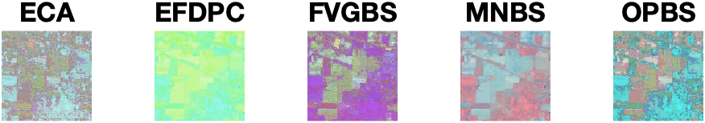

The SVM classification results on the selected bands.

    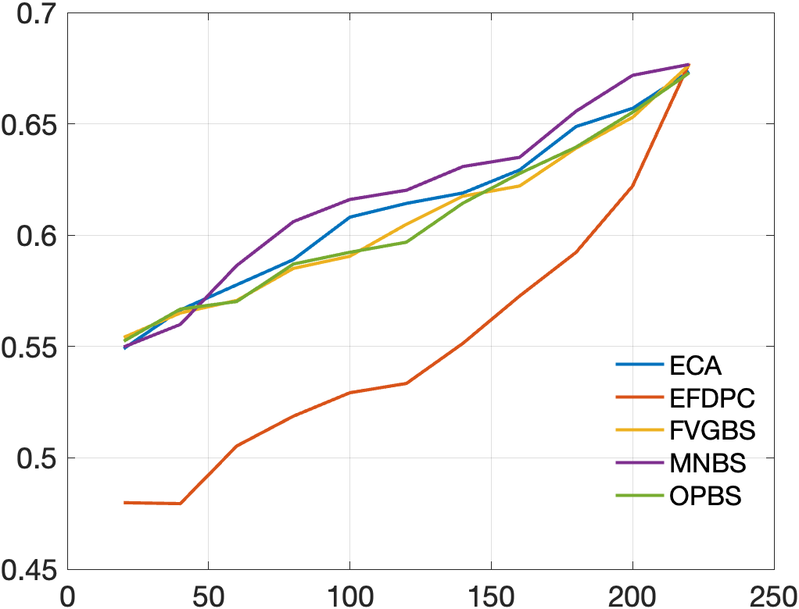

### Component Analysis Example

    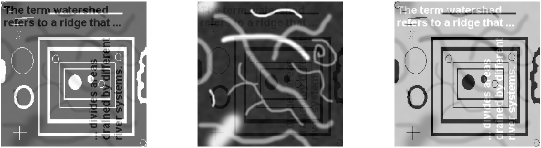
    
 Three mixed images 

    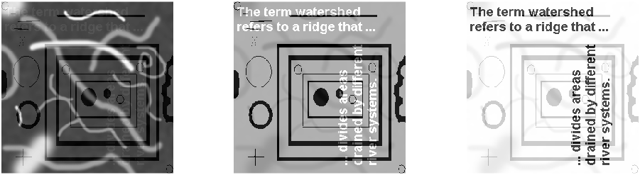
    
 PCA 

    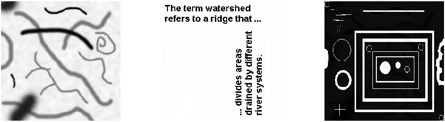
    
 FastICA 

    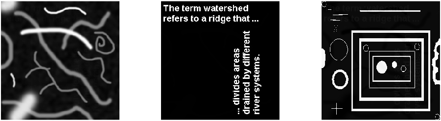
    
 PSA 

    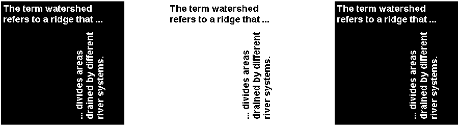
    
 NPSA 

### Dimension Reduction Example

    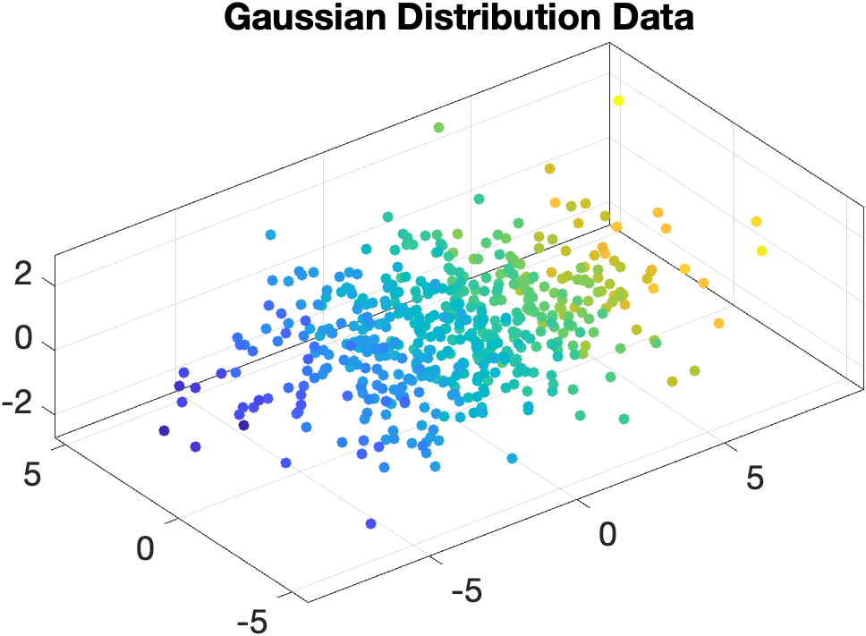

    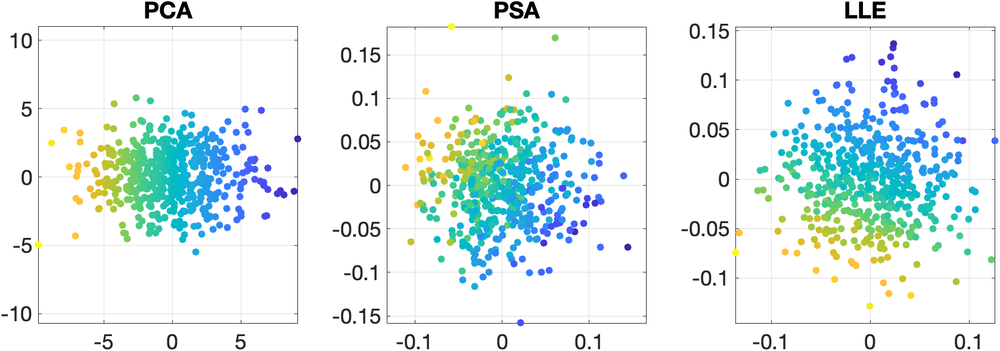

    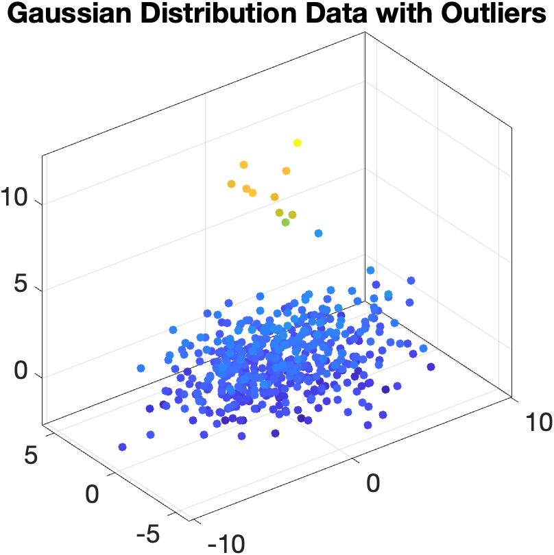

    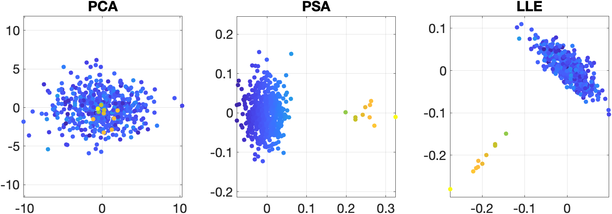

    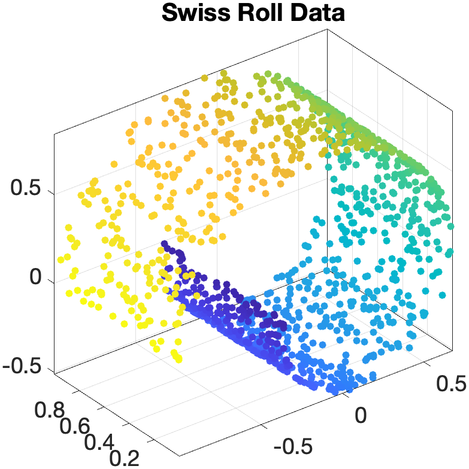

    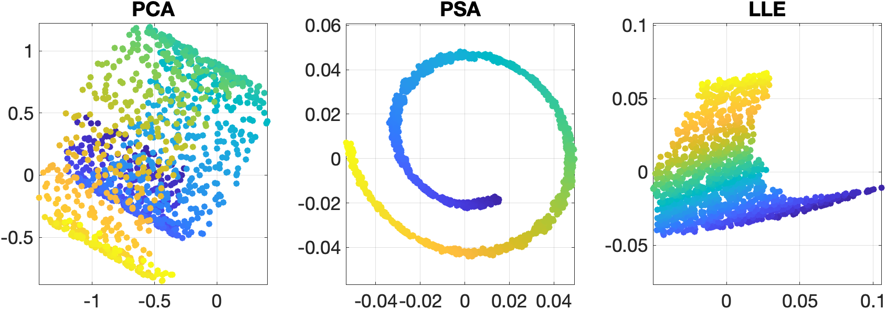

### Image Registration Example

Anti-noise performance of image registration algorithms

    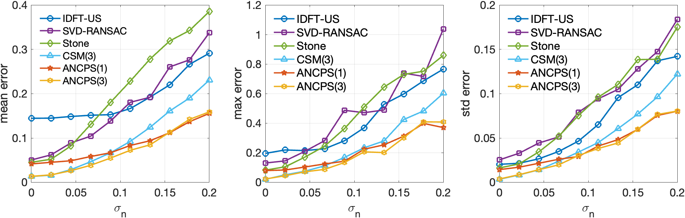

### Target Detection Example

Single target detection results of CEM, MF and SAM

    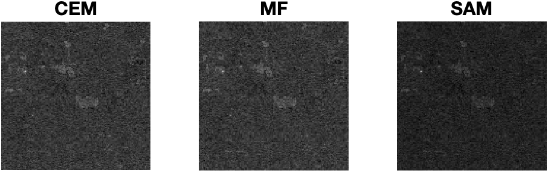

## Contributors

Made with [contrib.rocks](https://contrib.rocks).
