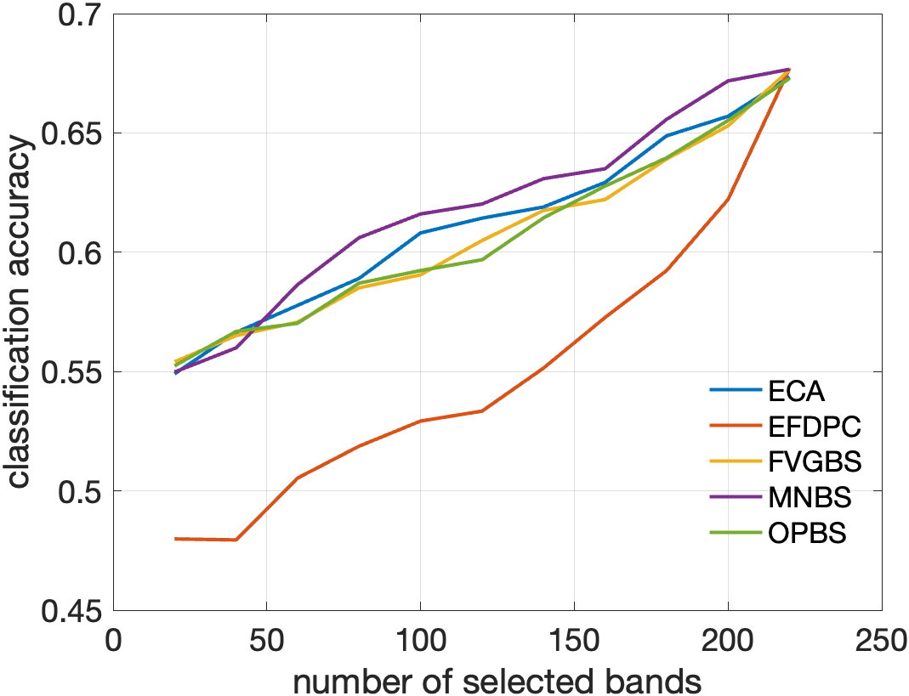
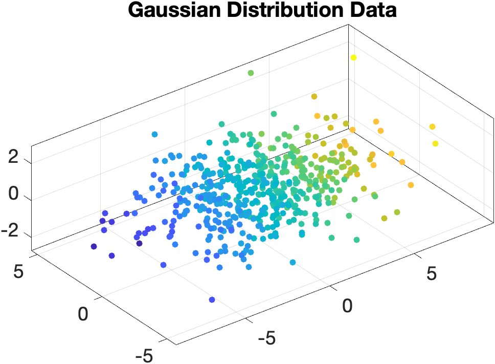
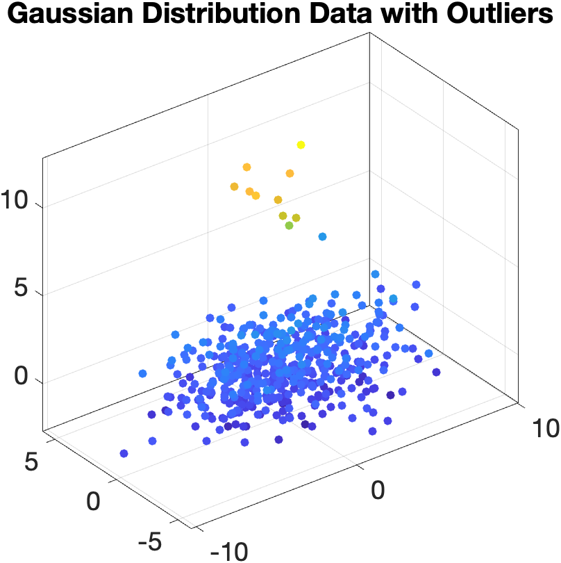
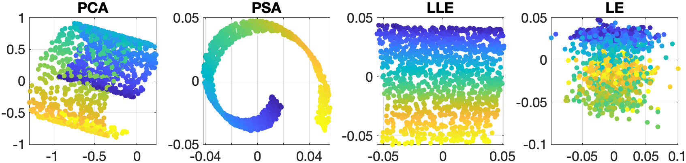

# Hyperspectral Image Toolbox ([中文](READEM_ZH.md))

This project aims to build a Matlab version of hyperspectral image processing toolbox, including but not limited to band selection, dimension reduction, clustering, classification, image registration, etc. The core purpose of this project is to facilitate everyone to learn and research hyperspectral image processing algorithms, so for each algorithm, detailed comments and explanations will be provided, as well as some simple examples. In addition, the project also provides some common hyperspectral datasets for testing.

Though this project is mainly about hyperspectral image processing, the algorithms involved are not limited to the field of hyperspectral image processing. Hyperspectral images are three-dimensional data, which can be seen as a combination of one-dimensional signals and two-dimensional signals (the spectral dimension can be seen as a one-dimensional signal, and the spatial dimension can be seen as a two-dimensional image). However, this combination cannot be seen as a simple combination, but a kind of dimensionality increase, which makes the hyperspectral image itself have special properties. And high-dimensional data often have similar properties, and hyperspectral images can be seen as the simplest example, and the only data that can be visualized (data with four or more dimensions cannot be directly visualized). Therefore, for those who want to further study and research data processing algorithms, why not use this project as a door opener or a stepping stone?

## Papers of the Algorithms

### Band Selection

-   [ECA](Papers/ECA.pdf) - Exemplar Component Analysis: A Fast Band Selection Method for Hyperspectral Imagery
-   [EFDPC](Papers/EFDPC.pdf) - A Novel Ranking-Based Clustering Approach for Hyperspectral Band Selection
-   [FVGBS](Papers/FVGBS.pdf) - Fast Volume Gradient Based Band Selection: A Fast Volume Gradient Based Band Selection Method for Hyperspectral_Image.
-   [MNBS](Papers/MNBS.pdf) - A New Band Selection Method for Hyperspectral Image Based on Data Quality
-   [OPBS](Papers/OPBS.pdf) - A Geometry-Based Band Selection Approach for Hyperspectral Image Analysis

### Clustering

-   [CCA](Papers/CCA.pdf) - Clustering of Continuous Attributes
-   [FSFDP](Papers/FSFDP.pdf) - Clustering by Fast Search and Find of Density Peaks
-   [MeanShift](Papers/Meanshift.pdf) - Mean Shift Clustering
-   [SC](Papers/SC.pdf) - Spectral Clustering
-   [SNMF](Papers/SNMF.pdf) - Symmetric Non-negative Matrix Factorization for Graph Clustering

### Data Analysis

-   [FastICA](Papers/FastICA.pdf) - Fast Independent Component Analysis
-   [LLE](Papers/LLE.pdf) - Locally Linear Embedding
-   [LS](Papers/LS.pdf) - Linear Least Squares Regression
-   [MNF](Papers/MNF.pdf) - Minimum Noise Fraction
-   [NNLS](Papers/NNLS.pdf) - Nonnegative Least Squares
-   [PCA](Papers/PCA.pdf) - Principal Component Analysis
-   [PSA](Papers/PSA.pdf) - Principal Skewness Analysis
-   [TLS](Papers/TLS.pdf) - Total Least Squares

### Endmember Extraction

-   [MVCNMF](Papers/MVCNMF.pdf) - Minimum Volume Constrained Nonnegative Matrix Factorization
-   [NFINDR](Papers/NFINDER.pdf) - N-FINDR: an algorithm for fast autonomous spectral end-member determination in hyperspectral data

### Image Registration

-   [ANCPS](Papers/ANCPS.pdf) - A New Translation Matching Method Based on Autocorrelated Normalized Cross-Power Spectrum
-   [CSM](Papers/CSM.pdf) - Cyclic Shift Matrix - A New Tool for the Translation Matching Problem
-   [HOGE](Papers/HOGE.pdf) - A Subspace Identification Extension to the Phase Correlation Method
-   [IDFT_US](Papers/IDFT_US.pdf) - Efficient subpixel image registration algorithms
-   [SVD_RANSAC](Papers/SVD_RANSAC.pdf) - A Novel Subpixel Phase Correlation Method Using Singular Value Decomposition and Unified Random Sample Consensus

### Target Detection

-   [CEM](Papers/CEM.pdf) - Constrianed Energy Minimization
-   MF - Matched Filter
-   [MTCEM](Papers/MTCEM.pdf) - Multiple Targets Constrained Energy Minimization
-   [MTICEM](Papers/MTICEM.pdf) - Multiple Targets Inequality Constrained Energy Minimization
-   [SACE](Papers/SimplexACE.pdf) - Simplex ACE: a constrained subspace detector
-   SAM - Spectral Angle Mapper

## Examples

### Band Selection Example

Select 3 bands to composite the false color image.

    

The SVM classification results on the selected bands.

    

### Component Analysis Example

    
    
 Three mixed images 

    
    
 PCA 

    
    
 FastICA 

    
    
 PSA 

    
    
 NPSA 

### Dimension Reduction Example

    

    

    

    

    

    

### Image Registration Example

Anti-noise performance of image registration algorithms

    

### Target Detection Example

Single target detection results of CEM, MF and SAM

    

## Contributors

Made with [contrib.rocks](https://contrib.rocks).
